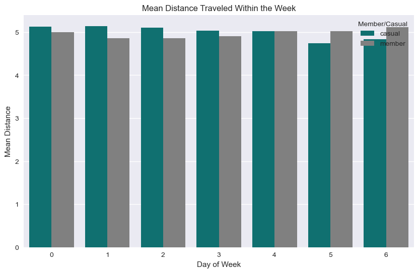

<p align="center">
  
</p>

# TABLE OF CONTENT
1. Summary
* 1.1. About Company 
* 1.2. Services
* 1.3. Products
2. Study Questions
3. Phase 1: Ask
* 3.1. Business Task
* 3.2. Key Stakeholders
4. Phase 2: Prepare
5. Phase 3: Process
6. Phase 4: Analyze
7. Phase 5: Share
8. Phase 6: Conclusion (Act)

# 1. SUMMARY

## 1.1. About Company

Cyclistic is a bike-sharing service with **5,824 bicycles** and **692 docking stations**. Cyclistic distinguishes itself by providing reclining bikes, hand tricycles, and cargo bikes, making bike-share more accessible to people with disabilities and riders who cannot use a standard two-wheeled bike. Nearly 92% of riders choose traditional bikes, while nearly 8% use assistive options. Cyclists are more likely to ride for pleasure, but approximately 30% use them to commute to work every day.

Annual members are significantly more profitable than casual riders, according to Cyclistic's financial analysts. Although the pricing flexibility aids Cyclistic in gaining more clients, Moreno (Director of Marketing) thinks that increasing the number of annual members will be essential for long-term success.

## 1.2. Services
* Casual Riders: 
    * Single-Ride Passes
    * Full-Day Passes
* Annual Membership

## Products
* Traditional Bikes (2-Wheeled Bikes)
* Assistive Bikes:
    * Reclining Bikes
    * Cargo Bikes
    * Hand Tricycles

**NOTE**: Annual Membership Profit **>** Casual Riders Profit

# 2. STUDY QUESTIONS

These 3 questions will guide the future marketing program:
1. How do annual members and casual riders use Cyclistic bikes differently?
2. Why would casual riders buy Cyclistic annual memberships?
3. How can Cyclistic use digital media to influence casual riders to become members?

# 3. PHASE 1: ASK

## 3.1. Business Task
The objective of this study is to design a new marketing strategy with my team in order to  convert casual riders (single-ride passes & full-day passes) into annual members (annual membership subscribers).

## 3.2. Key Stakeholders

* **Lily Moreno**: Director of Marketing and my manager.

* **Cyclistic Marketing Analytics Team**: A team of data analysts who are responsible for collecting, analyzing, and reporting data that helps guide Cyclistic marketing strategy.

* **Cyclistic Executive Team**: The detail-oriented executive team will decide whether to approve the recommended marketing program.

# 4. Phase 2: Prepare

* Dataset Used for this Analysis: The data source for our case study is from [Cyclistic's historical trip data](https://divvy-tripdata.s3.amazonaws.com/index.html). This dataset is stored in Kaggle and was made available through Motivate International Inc. under this [license](https://ride.divvybikes.com/data-license-agreement).


* Privacy and Accessibility of the Data: The owner has dedicated the work to the public domain by waiving all of his or her rights to the work worldwide under copyright law. We can copy and modify the dataset without asking permission.


* About the Dataset: Lyft Bikes and Scooters, LLC (“Bikeshare”) operates the City of Chicago’s (“City”) Divvy bicycle sharing service. Bikeshare and the City are committed to supporting bicycling as an alternative transportation option. As part of that commitment, the City permits Bikeshare to make certain Divvy system data owned by the City (“Data”) available to the public, subject to the terms and conditions of this License Agreement (“Agreement”). By accessing or using any of the Data, you agree to all of the terms and conditions of this Agreement.


* Data Organization and Verification: Available to us are 12 CSV documents. Each datasets contains 100,000-800,000 observations and 13 columns. Some of the column names include - ride_id, rideable_type, started_at, ended_at, start_station_name, start_station_id, end_station_name, end_station_id, start_lat, end_lat, start_lng, end_lng, member_casual.

# 5. Phase 3: Process

To conduct my analysis, I used Python because it allows me to clean, consolidate, analyze and visualize my data. Specifically, I used the "pandas", "matplotlib", "numpy" and "seaborn" packages to help manipulate the data. For added visualizations and dashboards, i used Power BI.

To begin with, i have downloaded the previous 12 month datasets then used Python for the data preparation and exploration. I have chosen this tool because of the versatility and ability to analyze large datasets which was a hurdle to open with Excel.

Before importing the datasets in Python, new columns were added to the dataset.

###  New Columns:
* **ride_length**	= df['ended_at'] - df['started_at']
* **day_of_week** = df['started_at'].dt.weekday. **Note: Monday = 0 and Sunday = 6**
* **days**: 
* **ride_length_minutes**: Shows the ride length in minutes
* **seasons**: Shows the season in which the ride took place
* **daytime**: Shows times of the day for each ride
* **month**: Extracts the month in which each ride took place
* **trip_distance**: Extracts the distance travelled by taking the coordinates into consoderation

To preceed with the exploration with Python, I have imported the relevant python packages for loading datasets, cleaning, wrangling, manipulation, visualization, etc...


```python
# importing packages

import numpy as np
import pandas as pd
import seaborn as sns
import matplotlib.pyplot as plt
import datetime
```


```python
# loading monthly datasets

df1 = pd.read_csv('202108-divvy-tripdata.csv')
df2 = pd.read_csv('202109-divvy-tripdata.csv')
df3 = pd.read_csv('202110-divvy-tripdata.csv')
df4 = pd.read_csv('202111-divvy-tripdata.csv')
df5 = pd.read_csv('202112-divvy-tripdata.csv')
df6 = pd.read_csv('202201-divvy-tripdata.csv')
df7 = pd.read_csv('202202-divvy-tripdata.csv')
df8 = pd.read_csv('202203-divvy-tripdata.csv')
df9 = pd.read_csv('202204-divvy-tripdata.csv')
df10 = pd.read_csv('202205-divvy-tripdata.csv')
df11 = pd.read_csv('202206-divvy-tripdata.csv')
df12 = pd.read_csv('202207-divvy-tripdata.csv')
df1.head()
```


<div>
<style scoped>
    .dataframe tbody tr th:only-of-type {
        vertical-align: middle;
    }

    .dataframe tbody tr th {
        vertical-align: top;
    }

    .dataframe thead th {
        text-align: right;
    }
</style>
<table border="1" class="dataframe">
  <thead>
    <tr style="text-align: right;">
      <th></th>
      <th>ride_id</th>
      <th>rideable_type</th>
      <th>started_at</th>
      <th>ended_at</th>
      <th>start_station_name</th>
      <th>start_station_id</th>
      <th>end_station_name</th>
      <th>end_station_id</th>
      <th>start_lat</th>
      <th>start_lng</th>
      <th>end_lat</th>
      <th>end_lng</th>
      <th>member_casual</th>
    </tr>
  </thead>
  <tbody>
    <tr>
      <th>0</th>
      <td>99103BB87CC6C1BB</td>
      <td>electric_bike</td>
      <td>2021-08-10 17:15:49</td>
      <td>2021-08-10 17:22:44</td>
      <td>NaN</td>
      <td>NaN</td>
      <td>NaN</td>
      <td>NaN</td>
      <td>41.77</td>
      <td>-87.68</td>
      <td>41.77</td>
      <td>-87.68</td>
      <td>member</td>
    </tr>
    <tr>
      <th>1</th>
      <td>EAFCCCFB0A3FC5A1</td>
      <td>electric_bike</td>
      <td>2021-08-10 17:23:14</td>
      <td>2021-08-10 17:39:24</td>
      <td>NaN</td>
      <td>NaN</td>
      <td>NaN</td>
      <td>NaN</td>
      <td>41.77</td>
      <td>-87.68</td>
      <td>41.77</td>
      <td>-87.63</td>
      <td>member</td>
    </tr>
    <tr>
      <th>2</th>
      <td>9EF4F46C57AD234D</td>
      <td>electric_bike</td>
      <td>2021-08-21 02:34:23</td>
      <td>2021-08-21 02:50:36</td>
      <td>NaN</td>
      <td>NaN</td>
      <td>NaN</td>
      <td>NaN</td>
      <td>41.95</td>
      <td>-87.65</td>
      <td>41.97</td>
      <td>-87.66</td>
      <td>member</td>
    </tr>
    <tr>
      <th>3</th>
      <td>5834D3208BFAF1DA</td>
      <td>electric_bike</td>
      <td>2021-08-21 06:52:55</td>
      <td>2021-08-21 07:08:13</td>
      <td>NaN</td>
      <td>NaN</td>
      <td>NaN</td>
      <td>NaN</td>
      <td>41.97</td>
      <td>-87.67</td>
      <td>41.95</td>
      <td>-87.65</td>
      <td>member</td>
    </tr>
    <tr>
      <th>4</th>
      <td>CD825CB87ED1D096</td>
      <td>electric_bike</td>
      <td>2021-08-19 11:55:29</td>
      <td>2021-08-19 12:04:11</td>
      <td>NaN</td>
      <td>NaN</td>
      <td>NaN</td>
      <td>NaN</td>
      <td>41.79</td>
      <td>-87.60</td>
      <td>41.77</td>
      <td>-87.62</td>
      <td>member</td>
    </tr>
  </tbody>
</table>
</div>


```python
# comparing uniformity in dataset structure by column names

print(df1.columns == df2.columns)
print(df1.columns == df3.columns)
print(df1.columns == df4.columns)
print(df1.columns == df5.columns)
print(df1.columns == df6.columns)
print(df1.columns == df7.columns)
print(df1.columns == df8.columns)
print(df1.columns == df9.columns)
print(df1.columns == df10.columns)
print(df1.columns == df11.columns)
print(df1.columns == df12.columns)

# all datasets have the same structure which makes it easier to merge for easy analysis.
```

    [ True  True  True  True  True  True  True  True  True  True  True  True
      True]
    [ True  True  True  True  True  True  True  True  True  True  True  True
      True]
    [ True  True  True  True  True  True  True  True  True  True  True  True
      True]
    [ True  True  True  True  True  True  True  True  True  True  True  True
      True]
    [ True  True  True  True  True  True  True  True  True  True  True  True
      True]
    [ True  True  True  True  True  True  True  True  True  True  True  True
      True]
    [ True  True  True  True  True  True  True  True  True  True  True  True
      True]
    [ True  True  True  True  True  True  True  True  True  True  True  True
      True]
    [ True  True  True  True  True  True  True  True  True  True  True  True
      True]
    [ True  True  True  True  True  True  True  True  True  True  True  True
      True]
    [ True  True  True  True  True  True  True  True  True  True  True  True
      True]
    


```python
# merging all datasets to form a single dataset

trip_data = pd.concat([df1,df2,df3,df4,df5,df6,df7,df8,df9,df10,df11,df12])

# snapshot of the first 5 rows of the new concatenated dataset (trip_data)
trip_data.head()
```


<div>
<style scoped>
    .dataframe tbody tr th:only-of-type {
        vertical-align: middle;
    }

    .dataframe tbody tr th {
        vertical-align: top;
    }

    .dataframe thead th {
        text-align: right;
    }
</style>
<table border="1" class="dataframe">
  <thead>
    <tr style="text-align: right;">
      <th></th>
      <th>ride_id</th>
      <th>rideable_type</th>
      <th>started_at</th>
      <th>ended_at</th>
      <th>start_station_name</th>
      <th>start_station_id</th>
      <th>end_station_name</th>
      <th>end_station_id</th>
      <th>start_lat</th>
      <th>start_lng</th>
      <th>end_lat</th>
      <th>end_lng</th>
      <th>member_casual</th>
    </tr>
  </thead>
  <tbody>
    <tr>
      <th>0</th>
      <td>99103BB87CC6C1BB</td>
      <td>electric_bike</td>
      <td>2021-08-10 17:15:49</td>
      <td>2021-08-10 17:22:44</td>
      <td>NaN</td>
      <td>NaN</td>
      <td>NaN</td>
      <td>NaN</td>
      <td>41.77</td>
      <td>-87.68</td>
      <td>41.77</td>
      <td>-87.68</td>
      <td>member</td>
    </tr>
    <tr>
      <th>1</th>
      <td>EAFCCCFB0A3FC5A1</td>
      <td>electric_bike</td>
      <td>2021-08-10 17:23:14</td>
      <td>2021-08-10 17:39:24</td>
      <td>NaN</td>
      <td>NaN</td>
      <td>NaN</td>
      <td>NaN</td>
      <td>41.77</td>
      <td>-87.68</td>
      <td>41.77</td>
      <td>-87.63</td>
      <td>member</td>
    </tr>
    <tr>
      <th>2</th>
      <td>9EF4F46C57AD234D</td>
      <td>electric_bike</td>
      <td>2021-08-21 02:34:23</td>
      <td>2021-08-21 02:50:36</td>
      <td>NaN</td>
      <td>NaN</td>
      <td>NaN</td>
      <td>NaN</td>
      <td>41.95</td>
      <td>-87.65</td>
      <td>41.97</td>
      <td>-87.66</td>
      <td>member</td>
    </tr>
    <tr>
      <th>3</th>
      <td>5834D3208BFAF1DA</td>
      <td>electric_bike</td>
      <td>2021-08-21 06:52:55</td>
      <td>2021-08-21 07:08:13</td>
      <td>NaN</td>
      <td>NaN</td>
      <td>NaN</td>
      <td>NaN</td>
      <td>41.97</td>
      <td>-87.67</td>
      <td>41.95</td>
      <td>-87.65</td>
      <td>member</td>
    </tr>
    <tr>
      <th>4</th>
      <td>CD825CB87ED1D096</td>
      <td>electric_bike</td>
      <td>2021-08-19 11:55:29</td>
      <td>2021-08-19 12:04:11</td>
      <td>NaN</td>
      <td>NaN</td>
      <td>NaN</td>
      <td>NaN</td>
      <td>41.79</td>
      <td>-87.60</td>
      <td>41.77</td>
      <td>-87.62</td>
      <td>member</td>
    </tr>
  </tbody>
</table>
</div>


### Summary of Dataset

The trip_data DataFrame has 5901463 rows and 13 columns. The columns include various data types, such as object (string) and float64 (numeric). The ride_id, rideable_type, started_at, ended_at, start_station_name, start_station_id, end_station_name, end_station_id, and member_casual columns are of type object, while the start_lat, start_lng, end_lat, and end_lng columns are of type float64.


```python
# checking merged data structure and types
print(trip_data.info())
```

    <class 'pandas.core.frame.DataFrame'>
    Int64Index: 5901463 entries, 0 to 823487
    Data columns (total 13 columns):
     #   Column              Dtype  
    ---  ------              -----  
     0   ride_id             object 
     1   rideable_type       object 
     2   started_at          object 
     3   ended_at            object 
     4   start_station_name  object 
     5   start_station_id    object 
     6   end_station_name    object 
     7   end_station_id      object 
     8   start_lat           float64
     9   start_lng           float64
     10  end_lat             float64
     11  end_lng             float64
     12  member_casual       object 
    dtypes: float64(4), object(9)
    memory usage: 630.3+ MB
    None
    

## Cleaning and Checking Data for Errors

**Checking for Duplicates**: The program shows there are no entries of duplicated data. 

**Checking for Missing/Null Values**: Only 5 columns has some missing values. These are:
   - start_station_name: 860786 rows
   - start_station_id: 860784 rows
   - end_station_name: 919896 rows
   - end_station_id: 919896 rows
   - end_lat: 5590 rows
   - end_lng: 5590 rows

All cells with object data types and float data type missing values  will be replaced with Not Available and mean (average) value respectively. None of the rows with the missing entries will be deleted since they contain other relevant column entries for our analysis.

**Checking for Unique Values**: We can comfirm that there is consistency with unique values for columns: **rideable_type**, **member_casual**, **day_of_week** and **days**.

**Change Data Types (dtypes)**: Converting ride_length and day_of_week column dtypes to datetime and Categorical dtypes respectively.


```python
# checking for duplicates
trip_duplicates = trip_data.duplicated(subset=None, keep=False)
trip_data[trip_duplicates].head().sort_values(by='ride_id')
print(trip_data[trip_duplicates].info())
```

    <class 'pandas.core.frame.DataFrame'>
    Int64Index: 0 entries
    Data columns (total 13 columns):
     #   Column              Non-Null Count  Dtype  
    ---  ------              --------------  -----  
     0   ride_id             0 non-null      object 
     1   rideable_type       0 non-null      object 
     2   started_at          0 non-null      object 
     3   ended_at            0 non-null      object 
     4   start_station_name  0 non-null      object 
     5   start_station_id    0 non-null      object 
     6   end_station_name    0 non-null      object 
     7   end_station_id      0 non-null      object 
     8   start_lat           0 non-null      float64
     9   start_lng           0 non-null      float64
     10  end_lat             0 non-null      float64
     11  end_lng             0 non-null      float64
     12  member_casual       0 non-null      object 
    dtypes: float64(4), object(9)
    memory usage: 0.0+ bytes
    None
    


```python
# checking for missing values
trip_data.isnull().sum()
```


    ride_id                    0
    rideable_type              0
    started_at                 0
    ended_at                   0
    start_station_name    860786
    start_station_id      860784
    end_station_name      919896
    end_station_id        919896
    start_lat                  0
    start_lng                  0
    end_lat                 5590
    end_lng                 5590
    member_casual              0
    dtype: int64


```python
# replacing missing values for object data types
replace_NA = trip_data[['start_station_name', 'start_station_id', 'end_station_name', 'end_station_id']].fillna('Not Available')
trip_data[['start_station_name', 'start_station_id', 'end_station_name', 'end_station_id']] = replace_NA
replace_NA.head()
```


<div>
<style scoped>
    .dataframe tbody tr th:only-of-type {
        vertical-align: middle;
    }

    .dataframe tbody tr th {
        vertical-align: top;
    }

    .dataframe thead th {
        text-align: right;
    }
</style>
<table border="1" class="dataframe">
  <thead>
    <tr style="text-align: right;">
      <th></th>
      <th>start_station_name</th>
      <th>start_station_id</th>
      <th>end_station_name</th>
      <th>end_station_id</th>
    </tr>
  </thead>
  <tbody>
    <tr>
      <th>0</th>
      <td>Not Available</td>
      <td>Not Available</td>
      <td>Not Available</td>
      <td>Not Available</td>
    </tr>
    <tr>
      <th>1</th>
      <td>Not Available</td>
      <td>Not Available</td>
      <td>Not Available</td>
      <td>Not Available</td>
    </tr>
    <tr>
      <th>2</th>
      <td>Not Available</td>
      <td>Not Available</td>
      <td>Not Available</td>
      <td>Not Available</td>
    </tr>
    <tr>
      <th>3</th>
      <td>Not Available</td>
      <td>Not Available</td>
      <td>Not Available</td>
      <td>Not Available</td>
    </tr>
    <tr>
      <th>4</th>
      <td>Not Available</td>
      <td>Not Available</td>
      <td>Not Available</td>
      <td>Not Available</td>
    </tr>
  </tbody>
</table>
</div>


```python
# replacing missing values for float data types
replace_mean = trip_data[['end_lat', 'end_lng']].fillna(trip_data[['end_lat', 'end_lng']]).mean()
trip_data[['end_lat', 'end_lng']] = replace_mean
replace_mean.head()
```


    end_lat    41.901021
    end_lng   -87.647608
    dtype: float64


```python
# all missing data have been successfully replaced
trip_data.isnull().sum()
```


    ride_id               0
    rideable_type         0
    started_at            0
    ended_at              0
    start_station_name    0
    start_station_id      0
    end_station_name      0
    end_station_id        0
    start_lat             0
    start_lng             0
    end_lat               0
    end_lng               0
    member_casual         0
    dtype: int64


```python
# converting started_at and ended_at columns into datetime data types

trip_data[['started_at', 'ended_at']] = trip_data[['started_at', 'ended_at']].apply(pd.to_datetime)
```


```python
# creating ride_length and day_of_week columns

trip_data['ride_length'] = trip_data['ended_at'] - trip_data['started_at']

# day_of_week where Monday = 0 and Sunday = 6
trip_data['day_of_week'] = trip_data['started_at'].dt.weekday
```


```python
# Creating a new column (days) and replacing day_of_week values from numerical to name of week days

trip_data['days'] = trip_data['day_of_week'].replace({0:'Monday', 
                                                      1:'Tuesday', 2:'Wednesday', 
                                                      3:'Thursday', 4:'Friday', 
                                                      5:'Saturday', 6:'Sunday'})
```


```python
# Convert day_of_week into a categorical data type

trip_data['day_of_week'] = trip_data['day_of_week'].astype('category')
trip_data.info()
```

    <class 'pandas.core.frame.DataFrame'>
    Int64Index: 5901463 entries, 0 to 823487
    Data columns (total 16 columns):
     #   Column              Dtype          
    ---  ------              -----          
     0   ride_id             object         
     1   rideable_type       object         
     2   started_at          datetime64[ns] 
     3   ended_at            datetime64[ns] 
     4   start_station_name  object         
     5   start_station_id    object         
     6   end_station_name    object         
     7   end_station_id      object         
     8   start_lat           float64        
     9   start_lng           float64        
     10  end_lat             float64        
     11  end_lng             float64        
     12  member_casual       object         
     13  ride_length         timedelta64[ns]
     14  day_of_week         category       
     15  days                object         
    dtypes: category(1), datetime64[ns](2), float64(4), object(8), timedelta64[ns](1)
    memory usage: 726.0+ MB
    


```python
# checking for unique values

print('rideable_type: ', trip_data['rideable_type'].unique(), "\n")
print('member_casual: ', trip_data['member_casual'].unique(), "\n")
print('day_of_week: ', sorted(trip_data['day_of_week'].unique()), "\n")
print('days: ', trip_data['days'].unique())
```

    rideable_type:  ['electric_bike' 'classic_bike' 'docked_bike'] 
    
    member_casual:  ['member' 'casual'] 
    
    day_of_week:  [0, 1, 2, 3, 4, 5, 6] 
    
    days:  ['Tuesday' 'Saturday' 'Thursday' 'Friday' 'Wednesday' 'Sunday' 'Monday']
    

# 6. Phase 4: Analyze

After data has been cleaned or processed, we can now proceed to organizing and performing calculations to identify relations and trends that helps answer the business questions.

I will be using mostly Python for the all analytical aspects of this data including visualizations. Tableau will be used to create more appealing visualizations to effectively communicate the results.


```python
# creating ride_length_minutes column from ride_length

trip_data["ride_length_minutes"] = trip_data["ride_length"].dt.total_seconds() / 60
trip_data.head(3)
```


<div>
<style scoped>
    .dataframe tbody tr th:only-of-type {
        vertical-align: middle;
    }

    .dataframe tbody tr th {
        vertical-align: top;
    }

    .dataframe thead th {
        text-align: right;
    }
</style>
<table border="1" class="dataframe">
  <thead>
    <tr style="text-align: right;">
      <th></th>
      <th>ride_id</th>
      <th>rideable_type</th>
      <th>started_at</th>
      <th>ended_at</th>
      <th>start_station_name</th>
      <th>start_station_id</th>
      <th>end_station_name</th>
      <th>end_station_id</th>
      <th>start_lat</th>
      <th>start_lng</th>
      <th>end_lat</th>
      <th>end_lng</th>
      <th>member_casual</th>
      <th>ride_length</th>
      <th>day_of_week</th>
      <th>days</th>
      <th>ride_length_minutes</th>
    </tr>
  </thead>
  <tbody>
    <tr>
      <th>0</th>
      <td>99103BB87CC6C1BB</td>
      <td>electric_bike</td>
      <td>2021-08-10 17:15:49</td>
      <td>2021-08-10 17:22:44</td>
      <td>Not Available</td>
      <td>Not Available</td>
      <td>Not Available</td>
      <td>Not Available</td>
      <td>41.77</td>
      <td>-87.68</td>
      <td>41.901021</td>
      <td>-87.647608</td>
      <td>member</td>
      <td>0 days 00:06:55</td>
      <td>1</td>
      <td>Tuesday</td>
      <td>6.916667</td>
    </tr>
    <tr>
      <th>1</th>
      <td>EAFCCCFB0A3FC5A1</td>
      <td>electric_bike</td>
      <td>2021-08-10 17:23:14</td>
      <td>2021-08-10 17:39:24</td>
      <td>Not Available</td>
      <td>Not Available</td>
      <td>Not Available</td>
      <td>Not Available</td>
      <td>41.77</td>
      <td>-87.68</td>
      <td>41.901021</td>
      <td>-87.647608</td>
      <td>member</td>
      <td>0 days 00:16:10</td>
      <td>1</td>
      <td>Tuesday</td>
      <td>16.166667</td>
    </tr>
    <tr>
      <th>2</th>
      <td>9EF4F46C57AD234D</td>
      <td>electric_bike</td>
      <td>2021-08-21 02:34:23</td>
      <td>2021-08-21 02:50:36</td>
      <td>Not Available</td>
      <td>Not Available</td>
      <td>Not Available</td>
      <td>Not Available</td>
      <td>41.95</td>
      <td>-87.65</td>
      <td>41.901021</td>
      <td>-87.647608</td>
      <td>member</td>
      <td>0 days 00:16:13</td>
      <td>5</td>
      <td>Saturday</td>
      <td>16.216667</td>
    </tr>
  </tbody>
</table>
</div>


```python
# Using descriptive statistics to get an overview of the entire dataset
trip_data.describe()
```


<div>
<style scoped>
    .dataframe tbody tr th:only-of-type {
        vertical-align: middle;
    }

    .dataframe tbody tr th {
        vertical-align: top;
    }

    .dataframe thead th {
        text-align: right;
    }
</style>
<table border="1" class="dataframe">
  <thead>
    <tr style="text-align: right;">
      <th></th>
      <th>start_lat</th>
      <th>start_lng</th>
      <th>end_lat</th>
      <th>end_lng</th>
      <th>ride_length</th>
      <th>ride_length_minutes</th>
    </tr>
  </thead>
  <tbody>
    <tr>
      <th>count</th>
      <td>5.901463e+06</td>
      <td>5.901463e+06</td>
      <td>5.901463e+06</td>
      <td>5.901463e+06</td>
      <td>5901463</td>
      <td>5.901463e+06</td>
    </tr>
    <tr>
      <th>mean</th>
      <td>4.190077e+01</td>
      <td>-8.764742e+01</td>
      <td>4.190102e+01</td>
      <td>-8.764761e+01</td>
      <td>0 days 00:19:53.376440723</td>
      <td>1.988961e+01</td>
    </tr>
    <tr>
      <th>std</th>
      <td>4.725668e-02</td>
      <td>3.093877e-02</td>
      <td>4.450215e-09</td>
      <td>9.468210e-09</td>
      <td>0 days 02:27:59.109436692</td>
      <td>1.479852e+02</td>
    </tr>
    <tr>
      <th>min</th>
      <td>4.164000e+01</td>
      <td>-8.784000e+01</td>
      <td>4.190102e+01</td>
      <td>-8.764761e+01</td>
      <td>-1 days +21:42:35</td>
      <td>-1.374167e+02</td>
    </tr>
    <tr>
      <th>25%</th>
      <td>4.188103e+01</td>
      <td>-8.766154e+01</td>
      <td>4.190102e+01</td>
      <td>-8.764761e+01</td>
      <td>0 days 00:06:10</td>
      <td>6.166667e+00</td>
    </tr>
    <tr>
      <th>50%</th>
      <td>4.189964e+01</td>
      <td>-8.764335e+01</td>
      <td>4.190102e+01</td>
      <td>-8.764761e+01</td>
      <td>0 days 00:10:57</td>
      <td>1.095000e+01</td>
    </tr>
    <tr>
      <th>75%</th>
      <td>4.192957e+01</td>
      <td>-8.762872e+01</td>
      <td>4.190102e+01</td>
      <td>-8.764761e+01</td>
      <td>0 days 00:19:49</td>
      <td>1.981667e+01</td>
    </tr>
    <tr>
      <th>max</th>
      <td>4.563503e+01</td>
      <td>-7.379648e+01</td>
      <td>4.190102e+01</td>
      <td>-8.764761e+01</td>
      <td>28 days 21:49:10</td>
      <td>4.162917e+04</td>
    </tr>
  </tbody>
</table>
</div>


The descriptive statistics for ride_length shows a negative min result. This could be as a result of data entry errors where the start time and end time were interchanged. This will be fixed in the next cell to eliminate any ride_length_minutes row with a value less than 1 minute or more than 1440  minutes. 


```python
# checking for inconsistent values for ride_length
outliers_ride_length = (trip_data["ride_length_minutes"] < 1) | (trip_data["ride_length_minutes"] > 1440)
outliers_ride_length.value_counts()
```


    False    5791938
    True      109525
    Name: ride_length_minutes, dtype: int64


```python
# Removing rows with outliers

trip_data.drop(trip_data.index[outliers_ride_length], inplace=True)
print('All outliers have been deleted')
```

    All outliers have been deleted
    


```python
# all rows with outliers have been removed

((trip_data["ride_length_minutes"] < 1) | (trip_data["ride_length_minutes"] > 1440)).value_counts()
```


    False    5071194
    Name: ride_length_minutes, dtype: int64


## Summary Statistics

Based on the descriptive statistics provided below, we can see that there are significant differences in the way that casual riders and annual members use the bike-share service.

Some key observations include:

* Member riders take more rides than Casual members: there are around 2.2 million rides taken by casual riders, compared to around 2.9 million rides taken by annual members.
* Casual riders take longer rides than annual members: on average, casual riders take rides that are 24.3 minutes long, while annual members take rides that are 12.9 minutes long.
* There is more variation in the trip duration taken by casual riders: the standard deviation of ride lengths for casual riders is 42.5 minutes, while the standard deviation for annual members is 19.1 minutes. This suggests that casual riders may be taking longer, more diverse types of rides than annual members.
* The longest trip duration is a little higher for member riders at 1439.95 as compared to 1439.92 for casual riders. The shortest trip duration for both riders is 1 minutes.

These differences suggest that casual riders may be using the bike-share service for different purposes than annual members. For example, casual riders may be more likely to use the service for longer, leisurely rides or for transportation to and from destinations that are further away. Annual members, on the other hand, may be more likely to use the service for shorter, more frequent trips, such as commuting to work or running errands.

To design a marketing strategy that targets casual riders and aims to convert them into annual members, it will be important to understand these differences in more detail and consider how they might influence the types of incentives or promotions that are most likely to be effective.


```python
# Group the data by the member_casual column and calculate summary statistics
summary_stats = trip_data.groupby("member_casual")["ride_length_minutes"].describe()
summary_stats
```


<div>
<style scoped>
    .dataframe tbody tr th:only-of-type {
        vertical-align: middle;
    }

    .dataframe tbody tr th {
        vertical-align: top;
    }

    .dataframe thead th {
        text-align: right;
    }
</style>
<table border="1" class="dataframe">
  <thead>
    <tr style="text-align: right;">
      <th></th>
      <th>count</th>
      <th>mean</th>
      <th>std</th>
      <th>min</th>
      <th>25%</th>
      <th>50%</th>
      <th>75%</th>
      <th>max</th>
    </tr>
    <tr>
      <th>member_casual</th>
      <th></th>
      <th></th>
      <th></th>
      <th></th>
      <th></th>
      <th></th>
      <th></th>
      <th></th>
    </tr>
  </thead>
  <tbody>
    <tr>
      <th>casual</th>
      <td>2179148.0</td>
      <td>24.295795</td>
      <td>42.502919</td>
      <td>1.0</td>
      <td>8.450000</td>
      <td>14.65</td>
      <td>26.600000</td>
      <td>1439.916667</td>
    </tr>
    <tr>
      <th>member</th>
      <td>2892046.0</td>
      <td>12.920055</td>
      <td>19.111587</td>
      <td>1.0</td>
      <td>5.416667</td>
      <td>9.20</td>
      <td>15.883333</td>
      <td>1439.950000</td>
    </tr>
  </tbody>
</table>
</div>


```python
# creating trip_distance column using geo data

trip_data["trip_distance"] = np.sqrt(((trip_data["end_lat"] - trip_data["start_lat"])**2) + ((trip_data["end_lng"] - trip_data["start_lng"])**2))
trip_data["trip_distance"] = trip_data["trip_distance"] * 111.139
```


```python
# Summary statistics of dataset

trip_data.describe()
```


<div>
<style scoped>
    .dataframe tbody tr th:only-of-type {
        vertical-align: middle;
    }

    .dataframe tbody tr th {
        vertical-align: top;
    }

    .dataframe thead th {
        text-align: right;
    }
</style>
<table border="1" class="dataframe">
  <thead>
    <tr style="text-align: right;">
      <th></th>
      <th>start_lat</th>
      <th>start_lng</th>
      <th>end_lat</th>
      <th>end_lng</th>
      <th>ride_length</th>
      <th>ride_length_minutes</th>
      <th>trip_distance</th>
    </tr>
  </thead>
  <tbody>
    <tr>
      <th>count</th>
      <td>5.071194e+06</td>
      <td>5.071194e+06</td>
      <td>5.071194e+06</td>
      <td>5.071194e+06</td>
      <td>5071194</td>
      <td>5.071194e+06</td>
      <td>5.071194e+06</td>
    </tr>
    <tr>
      <th>mean</th>
      <td>4.190087e+01</td>
      <td>-8.764739e+01</td>
      <td>4.190102e+01</td>
      <td>-8.764761e+01</td>
      <td>0 days 00:17:48.500153612</td>
      <td>1.780834e+01</td>
      <td>4.961660e+00</td>
    </tr>
    <tr>
      <th>std</th>
      <td>4.715035e-02</td>
      <td>3.036223e-02</td>
      <td>3.203617e-09</td>
      <td>7.084524e-09</td>
      <td>0 days 00:31:52.752662185</td>
      <td>3.187921e+01</td>
      <td>3.772230e+00</td>
    </tr>
    <tr>
      <th>min</th>
      <td>4.164000e+01</td>
      <td>-8.784000e+01</td>
      <td>4.190102e+01</td>
      <td>-8.764761e+01</td>
      <td>0 days 00:01:00</td>
      <td>1.000000e+00</td>
      <td>1.996711e-01</td>
    </tr>
    <tr>
      <th>25%</th>
      <td>4.188103e+01</td>
      <td>-8.766150e+01</td>
      <td>4.190102e+01</td>
      <td>-8.764761e+01</td>
      <td>0 days 00:06:24</td>
      <td>6.400000e+00</td>
      <td>2.501338e+00</td>
    </tr>
    <tr>
      <th>50%</th>
      <td>4.189993e+01</td>
      <td>-8.764335e+01</td>
      <td>4.190102e+01</td>
      <td>-8.764761e+01</td>
      <td>0 days 00:11:11</td>
      <td>1.118333e+01</td>
      <td>3.617545e+00</td>
    </tr>
    <tr>
      <th>75%</th>
      <td>4.192957e+01</td>
      <td>-8.762872e+01</td>
      <td>4.190102e+01</td>
      <td>-8.764761e+01</td>
      <td>0 days 00:20:04</td>
      <td>2.006667e+01</td>
      <td>5.963345e+00</td>
    </tr>
    <tr>
      <th>max</th>
      <td>4.207000e+01</td>
      <td>-8.752000e+01</td>
      <td>4.190102e+01</td>
      <td>-8.764761e+01</td>
      <td>0 days 23:59:57</td>
      <td>1.439950e+03</td>
      <td>3.137809e+01</td>
    </tr>
  </tbody>
</table>
</div>


# 7. Phase 5: Share

This phase of the project is to identify patterns and share findings from the data. Effective visualization will be shared in this section. As mentioned ealier, Tableau will be used for the visuals. 

Before proceeding to create our visualizations with Tableau, we first have to export our cleaned and transformed data as a CSV file as illustrated in the cell below:

### Percentage Distribution of Trips Taken

The distribution of customer types shows that 57.03% of trips taken by Cyclistic customers are members, while 42.74% (2,522,226) are casual riders. This indicates that the majority of the trips taken are by customers who have purchased an annual membership, while the other proportion of customers prefer to pay per ride.


```python
# Percentage of Trips Taken by Customer Types

# Count the number of rides for each customer type
customer_type = trip_data['member_casual'].value_counts()
print(customer_type)

plt.style.use('seaborn')
plt.pie(customer_type, labels = customer_type.index, radius = 1.4, autopct = '%0.2f%%', colors = ['teal', 'grey'], 
        textprops = {'fontsize' : 12})
plt.axis('equal')
plt.title('Pie Distribution of Customer Types', fontsize = 14 )
plt.legend(loc = 'upper right', fontsize = 12)

circle = plt.Circle(xy=(0,0), radius = 0.65, facecolor = 'white')
plt.gca().add_artist(circle)
```

    member    2892046
    casual    2179148
    Name: member_casual, dtype: int64
    


    <matplotlib.patches.Circle at 0x25fc47b6370>


    

    


### Distribution of Rideable Types by Users

Based on the given data, the distribution of rideable types by user type (member_casual) can be summarized as follows:

**Classic bikes**:
- Casual riders: 1,132,892 trips (44.92%)
- Member riders: 1,922,749 trips (56.90%)

**Docked bikes**:
- Casual riders: 226,728 trips (8.99%)

**Electric bikes**:
- Casual riders: 1,162,606 trips (46.09%)
- Member riders: 1,456,488 trips (43.10%)

These percentages represent the proportion of trips taken by each rideable type within each user type category. It shows that classic bikes are more popular among member riders, while electric bikes are more commonly used by casual riders. Docked bikes are primarily used by casual riders.


```python
# Count the number of trips taken by rideable_type and group them by member_casual
trip_counts = trip_data.groupby(['rideable_type', 'member_casual']).size().reset_index(name='count')

# Calculate the total count for each member_casual group
total_counts = trip_counts.groupby('member_casual')['count'].transform('sum')

# Calculate the percentage for each trip count
trip_counts['percentage'] = (trip_counts['count'] / total_counts) * 100
trip_counts.sort_values('member_casual')
```


<div>
<style scoped>
    .dataframe tbody tr th:only-of-type {
        vertical-align: middle;
    }

    .dataframe tbody tr th {
        vertical-align: top;
    }

    .dataframe thead th {
        text-align: right;
    }
</style>
<table border="1" class="dataframe">
  <thead>
    <tr style="text-align: right;">
      <th></th>
      <th>rideable_type</th>
      <th>member_casual</th>
      <th>count</th>
      <th>percentage</th>
    </tr>
  </thead>
  <tbody>
    <tr>
      <th>0</th>
      <td>classic_bike</td>
      <td>casual</td>
      <td>981619</td>
      <td>45.046000</td>
    </tr>
    <tr>
      <th>2</th>
      <td>docked_bike</td>
      <td>casual</td>
      <td>195924</td>
      <td>8.990853</td>
    </tr>
    <tr>
      <th>3</th>
      <td>electric_bike</td>
      <td>casual</td>
      <td>1001605</td>
      <td>45.963147</td>
    </tr>
    <tr>
      <th>1</th>
      <td>classic_bike</td>
      <td>member</td>
      <td>1647662</td>
      <td>56.972192</td>
    </tr>
    <tr>
      <th>4</th>
      <td>electric_bike</td>
      <td>member</td>
      <td>1244384</td>
      <td>43.027808</td>
    </tr>
  </tbody>
</table>
</div>


```python
# Group by member_casual and rideable_type
rideable_type_grouped = trip_data.groupby(['member_casual', 'rideable_type']).size().reset_index(name='count')

# Plot the bar chart
plt.figure(figsize=(8, 6))
sns.barplot(x='member_casual', y='count', hue='rideable_type', data=rideable_type_grouped)
plt.xlabel('Member/Casual')
plt.ylabel('Count')
plt.title('Distribution of Rideable Types by Users')
plt.legend(title='Rideable Type')
    
# Show the plot
plt.show()

```


    

    


### Trips Taken per Day

These findings suggest that there may be different usage patterns and preferences between Member and Casual riders, with Member riders tending to use the service more frequently on weekdays (Monday - Friday), while Casual riders have a higher proportion of rides on weekends (Saturday and Sunday).


```python
# Plotting Number of Trips Taken per Day

days_order = ['Monday', 'Tuesday', 'Wednesday', 'Thursday', 'Friday', 'Saturday', 'Sunday']

ax = sns.countplot(data=trip_data, x='days', hue='member_casual', color=sns.set_palette(["teal", "grey"]), order=days_order)
plt.title('Number of Rides per Day')
plt.ylabel('Number of Daily Rides')
plt.xlabel('Days')

# Adding labels to the x-axis
for p in ax.patches:
    ax.text(p.get_x() + p.get_width()/2., p.get_height(), '%d' % int(p.get_height()), 
            fontsize=8, color='black', ha='center', va='bottom')
    
# Placing the legend on the top right corner
ax.legend(title='User Type', bbox_to_anchor=(1.02, 1), loc='upper left')

plt.show()
```


    

    


```python
# Group by 'member_casual' and 'day_of_week', and calculate the mean distance
mean_distance = trip_data.groupby(['member_casual', 'day_of_week'])['trip_distance'].mean().reset_index()

# Plot the mean distances using a bar plot
plt.figure(figsize=(10, 6))
sns.barplot(x='day_of_week', y='trip_distance', hue='member_casual', data=mean_distance)
plt.xlabel('Day of Week')
plt.ylabel('Mean Distance')
plt.title('Mean Distance Traveled Within the Week')
plt.legend(title='Member/Casual')

# Show the plot
plt.show()
```


    

    


### Trips per Season

As observed from the diagram, most rides occurs during summer. Member riders accounts for most ride with a total sum of 1,209,267 rides whilst casual riders accounts for 1,187,777 rides during the summer.


```python
# Plotting Number of Rides per Season

trip_data['seasons'] = trip_data["started_at"].dt.month

# assign seasons to the season column
trip_data['seasons'] = trip_data['seasons'].apply(lambda x: "Winter" if x in [12, 1, 2] 
                        else "Spring" if x in [3, 4, 5] 
                        else "Summer" if x in [6, 7, 8] 
                        else "Fall")

season_order = ["Fall", "Summer", "Spring", "Winter"]
ax = sns.countplot(data=trip_data, x='seasons', hue='member_casual', color=sns.set_palette(["teal", "grey"]), order=season_order)
plt.title('Number of Rides per Season')
plt.ylabel('Number of Seasonal Rides (Million)')
plt.xlabel('Seasons')

# Adding labels to the x-axis
for p in ax.patches:
    ax.text(p.get_x() + p.get_width()/2., p.get_height(), '%d' % int(p.get_height()), 
            fontsize=8, color='black', ha='center', va='bottom')

plt.show()
```


    

    


## Trips per Daytime

We can depict from the diagram below that most trips occurs during the afternoon of which majority of the rides are from member riders as opposed to casual riders. The second most daytime trips occurs during the night then followed by morning trips.


```python
# Plotting the Number of Rides per Daytime

# create a new column for the day time
trip_data['daytime'] = trip_data["started_at"].dt.hour

# assign day times to the day_time column
trip_data['daytime'] = trip_data['daytime'].apply(lambda x: "Morning" if x in range(6, 12) 
                        else "Afternoon" if x in range(12, 18) 
                        else "Night")

daytime_order = ["Afternoon", "Night", "Morning"]
ax = sns.countplot(data=trip_data, x='daytime', hue='member_casual', color=sns.set_palette(["teal", "grey"]), order=daytime_order)
plt.title('Number of Rides per Day')
plt.xlabel('Day Time')
plt.ylabel('Number of Day Time Rides (Million)')

# Adding labels to the x-axis
for p in ax.patches:
    ax.text(p.get_x() + p.get_width()/2., p.get_height(), '%d' % int(p.get_height()), 
            fontsize=8, color='black', ha='center', va='bottom')
    
plt.show()
```


    

    


## Trips per Month


```python
# Plotting the Number of Rides per Month

# creating a month column
trip_data['month'] = trip_data["started_at"].dt.month
month_dict = {1: 'January', 2: 'February', 3: 'March', 4: 'April', 5: 'May', 6: 'June', 7: 'July', 8: 'August', 9: 'September', 10: 'October', 11: 'November', 12: 'December'}
trip_data['month'] = trip_data['month'].map(month_dict)
month_order = ['January', 'February', 'March', 'April', 'May', 'June', 'July', 'August', 'September', 'October', 'November', 'December']

ax = sns.countplot(data=trip_data, x='month', hue='member_casual', color=sns.set_palette(["teal", "grey"]), order=month_order)
plt.title('Number of Rides per Month')
plt.xlabel('Month')
plt.xticks(rotation=90)
plt.ylabel('Number of Monthly Rides')

# Adding labels to the x-axis
for p in ax.patches:
    ax.text(p.get_x() + p.get_width()/2., p.get_height(), '%d' % int(p.get_height()), 
            fontsize=6, color='black', ha='center', va='bottom')
    
plt.show()
print(ax)
```


    

    


    AxesSubplot(0.125,0.11;0.775x0.77)
    


```python
# creating a month column
trip_data['month'] = trip_data["started_at"].dt.month
month_dict = {1: 'January', 2: 'February', 3: 'March', 4: 'April', 5: 'May', 6: 'June', 
              7: 'July', 8: 'August', 9: 'September', 10: 'October', 11: 'November', 12: 'December'}
trip_data['month'] = trip_data['month'].map(month_dict)
month_order = ['January', 'February', 'March', 'April', 'May', 'June', 'July', 
               'August', 'September', 'October', 'November', 'December']

# Get the count of rides for each month and member_casual
monthly_rides = trip_data.groupby(['month','member_casual'])['ride_length_minutes'].size()

# convert the series into dataframe for seaborn plot
monthly_rides = monthly_rides.reset_index(name='count')

# Convert the 'month' column to a categorical variable with the desired order
monthly_rides['month'] = pd.Categorical(monthly_rides['month'], categories=month_order, ordered=True)

# Create the line plot with the ordered month variable as the x-axis
sns.lineplot(x='month', y='count', data=monthly_rides, hue='member_casual', color=sns.set_palette(["teal", "grey"]))
plt.title('Number of Rides per Month')
plt.xlabel('Month')
plt.xticks(rotation=90)
plt.ylabel('Number of Monthly Rides')

# Get the maximum and minimum values
max_value = monthly_rides['count'].max()
min_value = monthly_rides['count'].min()

# Annotate the maximum value
plt.annotate(f'Max: {max_value}', xy=(monthly_rides.loc[monthly_rides['count'] == max_value, 'month'].item(), max_value), xytext=(-10, 10), textcoords='offset points',
             arrowprops=dict(arrowstyle='->', connectionstyle='arc3,rad=.2'))

# Annotate the minimum value
plt.annotate(f'Min: {min_value}', xy=(monthly_rides.loc[monthly_rides['count'] == min_value, 'month'].item(), min_value), xytext=(-10, -20), textcoords='offset points',
             arrowprops=dict(arrowstyle='->', connectionstyle='arc3,rad=-.2'))


plt.show()
```


    

    


```python

# Group the data by month and member_casual columns
monthly_rides3 = trip_data.groupby(['month', 'member_casual'])['ride_length_minutes'].mean().reset_index()

# Use the seaborn library to create a bar plot
import seaborn as sns
sns.barplot(x='month', y='ride_length_minutes', hue='member_casual', data=monthly_rides3)

# Add x and y labels
plt.xlabel('Month')
plt.ylabel('Average Ride Length (minutes)')

# Rotate the x-axis labels to be vertical
plt.xticks(rotation=90)

# Show the plot
plt.show()

```


    

    


```python
trip_data
```


<div>
<style scoped>
    .dataframe tbody tr th:only-of-type {
        vertical-align: middle;
    }

    .dataframe tbody tr th {
        vertical-align: top;
    }

    .dataframe thead th {
        text-align: right;
    }
</style>
<table border="1" class="dataframe">
  <thead>
    <tr style="text-align: right;">
      <th></th>
      <th>ride_id</th>
      <th>rideable_type</th>
      <th>started_at</th>
      <th>ended_at</th>
      <th>start_station_name</th>
      <th>start_station_id</th>
      <th>end_station_name</th>
      <th>end_station_id</th>
      <th>start_lat</th>
      <th>start_lng</th>
      <th>...</th>
      <th>end_lng</th>
      <th>member_casual</th>
      <th>ride_length</th>
      <th>day_of_week</th>
      <th>days</th>
      <th>ride_length_minutes</th>
      <th>trip_distance</th>
      <th>seasons</th>
      <th>daytime</th>
      <th>month</th>
    </tr>
  </thead>
  <tbody>
    <tr>
      <th>0</th>
      <td>99103BB87CC6C1BB</td>
      <td>electric_bike</td>
      <td>2021-08-10 17:15:49</td>
      <td>2021-08-10 17:22:44</td>
      <td>Not Available</td>
      <td>Not Available</td>
      <td>Not Available</td>
      <td>Not Available</td>
      <td>41.77</td>
      <td>-87.68</td>
      <td>...</td>
      <td>-87.647608</td>
      <td>member</td>
      <td>0 days 00:06:55</td>
      <td>1</td>
      <td>Tuesday</td>
      <td>6.916667</td>
      <td>14.999919</td>
      <td>Summer</td>
      <td>Afternoon</td>
      <td>August</td>
    </tr>
    <tr>
      <th>1</th>
      <td>EAFCCCFB0A3FC5A1</td>
      <td>electric_bike</td>
      <td>2021-08-10 17:23:14</td>
      <td>2021-08-10 17:39:24</td>
      <td>Not Available</td>
      <td>Not Available</td>
      <td>Not Available</td>
      <td>Not Available</td>
      <td>41.77</td>
      <td>-87.68</td>
      <td>...</td>
      <td>-87.647608</td>
      <td>member</td>
      <td>0 days 00:16:10</td>
      <td>1</td>
      <td>Tuesday</td>
      <td>16.166667</td>
      <td>14.999919</td>
      <td>Summer</td>
      <td>Afternoon</td>
      <td>August</td>
    </tr>
    <tr>
      <th>2</th>
      <td>9EF4F46C57AD234D</td>
      <td>electric_bike</td>
      <td>2021-08-21 02:34:23</td>
      <td>2021-08-21 02:50:36</td>
      <td>Not Available</td>
      <td>Not Available</td>
      <td>Not Available</td>
      <td>Not Available</td>
      <td>41.95</td>
      <td>-87.65</td>
      <td>...</td>
      <td>-87.647608</td>
      <td>member</td>
      <td>0 days 00:16:13</td>
      <td>5</td>
      <td>Saturday</td>
      <td>16.216667</td>
      <td>5.449995</td>
      <td>Summer</td>
      <td>Night</td>
      <td>August</td>
    </tr>
    <tr>
      <th>3</th>
      <td>5834D3208BFAF1DA</td>
      <td>electric_bike</td>
      <td>2021-08-21 06:52:55</td>
      <td>2021-08-21 07:08:13</td>
      <td>Not Available</td>
      <td>Not Available</td>
      <td>Not Available</td>
      <td>Not Available</td>
      <td>41.97</td>
      <td>-87.67</td>
      <td>...</td>
      <td>-87.647608</td>
      <td>member</td>
      <td>0 days 00:15:18</td>
      <td>5</td>
      <td>Saturday</td>
      <td>15.300000</td>
      <td>8.060094</td>
      <td>Summer</td>
      <td>Morning</td>
      <td>August</td>
    </tr>
    <tr>
      <th>4</th>
      <td>CD825CB87ED1D096</td>
      <td>electric_bike</td>
      <td>2021-08-19 11:55:29</td>
      <td>2021-08-19 12:04:11</td>
      <td>Not Available</td>
      <td>Not Available</td>
      <td>Not Available</td>
      <td>Not Available</td>
      <td>41.79</td>
      <td>-87.60</td>
      <td>...</td>
      <td>-87.647608</td>
      <td>member</td>
      <td>0 days 00:08:42</td>
      <td>3</td>
      <td>Thursday</td>
      <td>8.700000</td>
      <td>13.425361</td>
      <td>Summer</td>
      <td>Morning</td>
      <td>August</td>
    </tr>
    <tr>
      <th>...</th>
      <td>...</td>
      <td>...</td>
      <td>...</td>
      <td>...</td>
      <td>...</td>
      <td>...</td>
      <td>...</td>
      <td>...</td>
      <td>...</td>
      <td>...</td>
      <td>...</td>
      <td>...</td>
      <td>...</td>
      <td>...</td>
      <td>...</td>
      <td>...</td>
      <td>...</td>
      <td>...</td>
      <td>...</td>
      <td>...</td>
      <td>...</td>
    </tr>
    <tr>
      <th>823483</th>
      <td>605787F70B3B9FD3</td>
      <td>electric_bike</td>
      <td>2022-07-09 08:32:15</td>
      <td>2022-07-09 08:56:10</td>
      <td>Not Available</td>
      <td>Not Available</td>
      <td>Not Available</td>
      <td>Not Available</td>
      <td>41.74</td>
      <td>-87.68</td>
      <td>...</td>
      <td>-87.647608</td>
      <td>member</td>
      <td>0 days 00:23:55</td>
      <td>5</td>
      <td>Saturday</td>
      <td>23.916667</td>
      <td>18.254188</td>
      <td>Summer</td>
      <td>Morning</td>
      <td>July</td>
    </tr>
    <tr>
      <th>823484</th>
      <td>F0EECBEE637DF028</td>
      <td>electric_bike</td>
      <td>2022-07-17 13:27:57</td>
      <td>2022-07-17 13:33:09</td>
      <td>Not Available</td>
      <td>Not Available</td>
      <td>Not Available</td>
      <td>Not Available</td>
      <td>41.87</td>
      <td>-87.66</td>
      <td>...</td>
      <td>-87.647608</td>
      <td>member</td>
      <td>0 days 00:05:12</td>
      <td>6</td>
      <td>Sunday</td>
      <td>5.200000</td>
      <td>3.712511</td>
      <td>Summer</td>
      <td>Afternoon</td>
      <td>July</td>
    </tr>
    <tr>
      <th>823485</th>
      <td>B8B091DC72DDAB9D</td>
      <td>electric_bike</td>
      <td>2022-07-17 14:51:37</td>
      <td>2022-07-17 14:57:01</td>
      <td>Not Available</td>
      <td>Not Available</td>
      <td>Not Available</td>
      <td>Not Available</td>
      <td>41.95</td>
      <td>-87.64</td>
      <td>...</td>
      <td>-87.647608</td>
      <td>member</td>
      <td>0 days 00:05:24</td>
      <td>6</td>
      <td>Sunday</td>
      <td>5.400000</td>
      <td>5.508790</td>
      <td>Summer</td>
      <td>Afternoon</td>
      <td>July</td>
    </tr>
    <tr>
      <th>823486</th>
      <td>B4D3FFCC1F3AF5EC</td>
      <td>electric_bike</td>
      <td>2022-07-28 13:41:50</td>
      <td>2022-07-28 13:47:17</td>
      <td>Not Available</td>
      <td>Not Available</td>
      <td>Not Available</td>
      <td>Not Available</td>
      <td>41.88</td>
      <td>-87.63</td>
      <td>...</td>
      <td>-87.647608</td>
      <td>member</td>
      <td>0 days 00:05:27</td>
      <td>3</td>
      <td>Thursday</td>
      <td>5.450000</td>
      <td>3.047559</td>
      <td>Summer</td>
      <td>Afternoon</td>
      <td>July</td>
    </tr>
    <tr>
      <th>823487</th>
      <td>AA9217C8DA3BAC0B</td>
      <td>electric_bike</td>
      <td>2022-07-29 13:05:20</td>
      <td>2022-07-29 13:10:40</td>
      <td>Not Available</td>
      <td>Not Available</td>
      <td>Not Available</td>
      <td>Not Available</td>
      <td>41.90</td>
      <td>-87.66</td>
      <td>...</td>
      <td>-87.647608</td>
      <td>member</td>
      <td>0 days 00:05:20</td>
      <td>4</td>
      <td>Friday</td>
      <td>5.333333</td>
      <td>1.381877</td>
      <td>Summer</td>
      <td>Afternoon</td>
      <td>July</td>
    </tr>
  </tbody>
</table>
<p>5071194 rows × 21 columns</p>
</div>


```python
# Exporting dataset as a csv file

trip_data.to_csv('trip_data.csv')
print("Dataset exported as CSV file successfully.")
```

    Dataset exported as CSV file successfully.
    


```python
pd.read_csv('trip_data.csv')
```


<div>
<style scoped>
    .dataframe tbody tr th:only-of-type {
        vertical-align: middle;
    }

    .dataframe tbody tr th {
        vertical-align: top;
    }

    .dataframe thead th {
        text-align: right;
    }
</style>
<table border="1" class="dataframe">
  <thead>
    <tr style="text-align: right;">
      <th></th>
      <th>Unnamed: 0</th>
      <th>ride_id</th>
      <th>rideable_type</th>
      <th>started_at</th>
      <th>ended_at</th>
      <th>start_station_name</th>
      <th>start_station_id</th>
      <th>end_station_name</th>
      <th>end_station_id</th>
      <th>start_lat</th>
      <th>...</th>
      <th>end_lng</th>
      <th>member_casual</th>
      <th>ride_length</th>
      <th>day_of_week</th>
      <th>days</th>
      <th>ride_length_minutes</th>
      <th>trip_distance</th>
      <th>seasons</th>
      <th>daytime</th>
      <th>month</th>
    </tr>
  </thead>
  <tbody>
    <tr>
      <th>0</th>
      <td>0</td>
      <td>99103BB87CC6C1BB</td>
      <td>electric_bike</td>
      <td>2021-08-10 17:15:49</td>
      <td>2021-08-10 17:22:44</td>
      <td>Not Available</td>
      <td>Not Available</td>
      <td>Not Available</td>
      <td>Not Available</td>
      <td>41.77</td>
      <td>...</td>
      <td>-87.647608</td>
      <td>member</td>
      <td>0 days 00:06:55</td>
      <td>1</td>
      <td>Tuesday</td>
      <td>6.916667</td>
      <td>14.999919</td>
      <td>Summer</td>
      <td>Afternoon</td>
      <td>August</td>
    </tr>
    <tr>
      <th>1</th>
      <td>1</td>
      <td>EAFCCCFB0A3FC5A1</td>
      <td>electric_bike</td>
      <td>2021-08-10 17:23:14</td>
      <td>2021-08-10 17:39:24</td>
      <td>Not Available</td>
      <td>Not Available</td>
      <td>Not Available</td>
      <td>Not Available</td>
      <td>41.77</td>
      <td>...</td>
      <td>-87.647608</td>
      <td>member</td>
      <td>0 days 00:16:10</td>
      <td>1</td>
      <td>Tuesday</td>
      <td>16.166667</td>
      <td>14.999919</td>
      <td>Summer</td>
      <td>Afternoon</td>
      <td>August</td>
    </tr>
    <tr>
      <th>2</th>
      <td>2</td>
      <td>9EF4F46C57AD234D</td>
      <td>electric_bike</td>
      <td>2021-08-21 02:34:23</td>
      <td>2021-08-21 02:50:36</td>
      <td>Not Available</td>
      <td>Not Available</td>
      <td>Not Available</td>
      <td>Not Available</td>
      <td>41.95</td>
      <td>...</td>
      <td>-87.647608</td>
      <td>member</td>
      <td>0 days 00:16:13</td>
      <td>5</td>
      <td>Saturday</td>
      <td>16.216667</td>
      <td>5.449995</td>
      <td>Summer</td>
      <td>Night</td>
      <td>August</td>
    </tr>
    <tr>
      <th>3</th>
      <td>3</td>
      <td>5834D3208BFAF1DA</td>
      <td>electric_bike</td>
      <td>2021-08-21 06:52:55</td>
      <td>2021-08-21 07:08:13</td>
      <td>Not Available</td>
      <td>Not Available</td>
      <td>Not Available</td>
      <td>Not Available</td>
      <td>41.97</td>
      <td>...</td>
      <td>-87.647608</td>
      <td>member</td>
      <td>0 days 00:15:18</td>
      <td>5</td>
      <td>Saturday</td>
      <td>15.300000</td>
      <td>8.060094</td>
      <td>Summer</td>
      <td>Morning</td>
      <td>August</td>
    </tr>
    <tr>
      <th>4</th>
      <td>4</td>
      <td>CD825CB87ED1D096</td>
      <td>electric_bike</td>
      <td>2021-08-19 11:55:29</td>
      <td>2021-08-19 12:04:11</td>
      <td>Not Available</td>
      <td>Not Available</td>
      <td>Not Available</td>
      <td>Not Available</td>
      <td>41.79</td>
      <td>...</td>
      <td>-87.647608</td>
      <td>member</td>
      <td>0 days 00:08:42</td>
      <td>3</td>
      <td>Thursday</td>
      <td>8.700000</td>
      <td>13.425361</td>
      <td>Summer</td>
      <td>Morning</td>
      <td>August</td>
    </tr>
    <tr>
      <th>...</th>
      <td>...</td>
      <td>...</td>
      <td>...</td>
      <td>...</td>
      <td>...</td>
      <td>...</td>
      <td>...</td>
      <td>...</td>
      <td>...</td>
      <td>...</td>
      <td>...</td>
      <td>...</td>
      <td>...</td>
      <td>...</td>
      <td>...</td>
      <td>...</td>
      <td>...</td>
      <td>...</td>
      <td>...</td>
      <td>...</td>
      <td>...</td>
    </tr>
    <tr>
      <th>5071189</th>
      <td>823483</td>
      <td>605787F70B3B9FD3</td>
      <td>electric_bike</td>
      <td>2022-07-09 08:32:15</td>
      <td>2022-07-09 08:56:10</td>
      <td>Not Available</td>
      <td>Not Available</td>
      <td>Not Available</td>
      <td>Not Available</td>
      <td>41.74</td>
      <td>...</td>
      <td>-87.647608</td>
      <td>member</td>
      <td>0 days 00:23:55</td>
      <td>5</td>
      <td>Saturday</td>
      <td>23.916667</td>
      <td>18.254188</td>
      <td>Summer</td>
      <td>Morning</td>
      <td>July</td>
    </tr>
    <tr>
      <th>5071190</th>
      <td>823484</td>
      <td>F0EECBEE637DF028</td>
      <td>electric_bike</td>
      <td>2022-07-17 13:27:57</td>
      <td>2022-07-17 13:33:09</td>
      <td>Not Available</td>
      <td>Not Available</td>
      <td>Not Available</td>
      <td>Not Available</td>
      <td>41.87</td>
      <td>...</td>
      <td>-87.647608</td>
      <td>member</td>
      <td>0 days 00:05:12</td>
      <td>6</td>
      <td>Sunday</td>
      <td>5.200000</td>
      <td>3.712511</td>
      <td>Summer</td>
      <td>Afternoon</td>
      <td>July</td>
    </tr>
    <tr>
      <th>5071191</th>
      <td>823485</td>
      <td>B8B091DC72DDAB9D</td>
      <td>electric_bike</td>
      <td>2022-07-17 14:51:37</td>
      <td>2022-07-17 14:57:01</td>
      <td>Not Available</td>
      <td>Not Available</td>
      <td>Not Available</td>
      <td>Not Available</td>
      <td>41.95</td>
      <td>...</td>
      <td>-87.647608</td>
      <td>member</td>
      <td>0 days 00:05:24</td>
      <td>6</td>
      <td>Sunday</td>
      <td>5.400000</td>
      <td>5.508790</td>
      <td>Summer</td>
      <td>Afternoon</td>
      <td>July</td>
    </tr>
    <tr>
      <th>5071192</th>
      <td>823486</td>
      <td>B4D3FFCC1F3AF5EC</td>
      <td>electric_bike</td>
      <td>2022-07-28 13:41:50</td>
      <td>2022-07-28 13:47:17</td>
      <td>Not Available</td>
      <td>Not Available</td>
      <td>Not Available</td>
      <td>Not Available</td>
      <td>41.88</td>
      <td>...</td>
      <td>-87.647608</td>
      <td>member</td>
      <td>0 days 00:05:27</td>
      <td>3</td>
      <td>Thursday</td>
      <td>5.450000</td>
      <td>3.047559</td>
      <td>Summer</td>
      <td>Afternoon</td>
      <td>July</td>
    </tr>
    <tr>
      <th>5071193</th>
      <td>823487</td>
      <td>AA9217C8DA3BAC0B</td>
      <td>electric_bike</td>
      <td>2022-07-29 13:05:20</td>
      <td>2022-07-29 13:10:40</td>
      <td>Not Available</td>
      <td>Not Available</td>
      <td>Not Available</td>
      <td>Not Available</td>
      <td>41.90</td>
      <td>...</td>
      <td>-87.647608</td>
      <td>member</td>
      <td>0 days 00:05:20</td>
      <td>4</td>
      <td>Friday</td>
      <td>5.333333</td>
      <td>1.381877</td>
      <td>Summer</td>
      <td>Afternoon</td>
      <td>July</td>
    </tr>
  </tbody>
</table>
<p>5071194 rows × 22 columns</p>
</div>


# 8. Phase 6: Conclusion (Act)

The purchase of this phase is to discuss the findings from the analysis and suggest possible optional decisions that the key stakeholders should act on. The following study questions as mentioned previously which we seek to answer are as follow:

1. How do annual members and casual riders use Cyclistic bikes differently?
2. Why would casual riders buy Cyclistic annual memberships?
3. How can Cyclistic use digital media to influence casual riders to become members?

## 8.1. Summary of Findings

The findings from our analysis reveals the following:

_Note: All figures used in this section are approximated to the nearest whole number._ 

1. **Distribution of User Types**: Cyclistic has more member riders than casual riders. This inherently means that a higher chunk of the company's profit comes from annual member riders. This result matches with the finance analyst observation that annual members are much more profitable than casual riders. To put the figures into perpectives, 57% of riders are annual members, whilst 43% of the riders are casual riders.


2. **Distribution of Ride Types**: Cyclistic has 3 main types of rides: classic bikes, electric bikes and docked bikes. According to our analysis, 52% of all rides chosen are classic bikes which are basically 2-wheeled traditional bikes. Electric bikes has the second highest distribution with 44%, whilst the least used bike form are docked bikes with a usage share of 4%. 


3. **Number of Rides per Day**
    * **3.1.** Member riders have an almost equally distributed usage rate per day with peak days Tuesday, Wednesday, Thursday, and Saturday averaging 450,000 rides. Sunday has the lowest amount of rides at 360,000, whilst Monday and Friday are both averaging 400,000 rides. 
    
    * **3.2.** The highest number of rides taken by casual riders is recorded on Saturday with a total of 460,000. This record not only applies to casual riders but is the highest recorded ride in a day for Cyclistic during the entire 12 month period. The second highest rides are taken on Sundays with a total of 410,000. Tuesdays and Wenesdays records the lowest number of rides at an average of 240,000. 
    
    
4. **Number of Ride Type per User**
    * **4.1.** A higher proportion of member riders choose classic bikes followed by electric bikes. Within the analyzed 12 month period, non of the member riders chose docked bikes. 
    * **4.2.** A slighly higher proportion of casual riders chose electric bikes followed by classic bikes. All rides taken with docked bikes comes from casual riders with the total number of 200,000 rides which represents the 4% distribution of ride type within the period. 
    
    
5. **Percentage of Total Rides per Month**: Both member and casual riders record their highest number of rides on July with an average of 7%. The second and third highest number of rides are on August and June, respectively for casual riders. For member riders, the second and third rides were taken on June and August. Both customer types have their lowest number of rides recorded on January with 1% for members and 0.3% for casual riders. 
    
    
6. **Number of Rides per Season**: Most rides are taken during summer for both members and casual riders at an average of 1 million. The second highest number of rides is recorded during Fall, followed by Spring and then Winter as the lowest. 

7. **Ride Length**: It is revealed that casual riders take longer rides on average than member riders. 

## 8.2. Recommendations 

The supported recommendations from the author is as follow:


1. Since casual riders take longer rides on average than member riders, marketing should be targeted towards showing the cost savings that casual riders will benefit from switching to annual membership. It should be clear from the ad campaign that the monthly expense from casual riders is more as compared to the standard monthly cost of subscriptions. 


2. Further incentives like discount offers can be included in the campaign to drive interest for clients to make the switch from casual to annual membership. 


3. Winter season has the lowest number of rides taken. In order to improve rides during this season, we recommend that Cyclistic should improve riding comfort by offering safety gears like gloves, nose masks, winter tires, and winter jackets. These offerings can be made more effective through  partnership with local retailers. 


4. Cyclistic should offer specialized Saturday and Sunday discounts to attract members to take more rides during these days. The point-earning system can be introduced which gives people an opportunity to earn points to attractive discounts to online retailers like food delivery, fashion, and supermarkets. 
