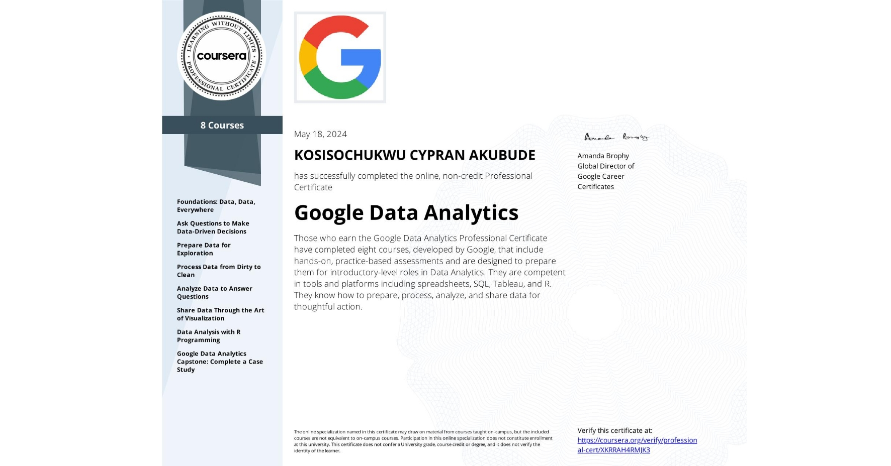
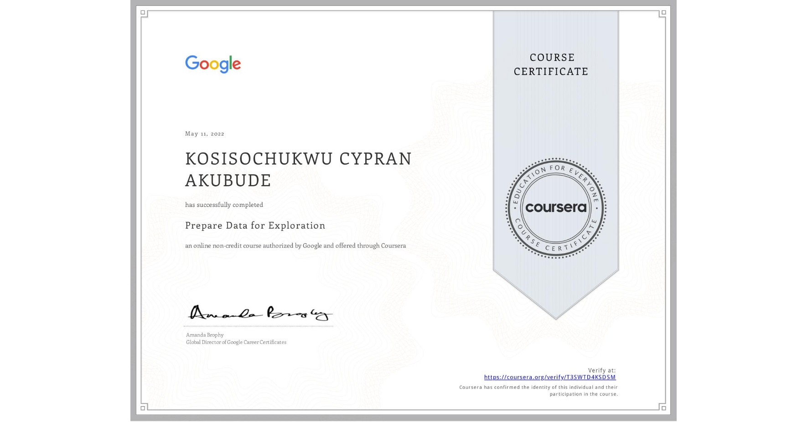
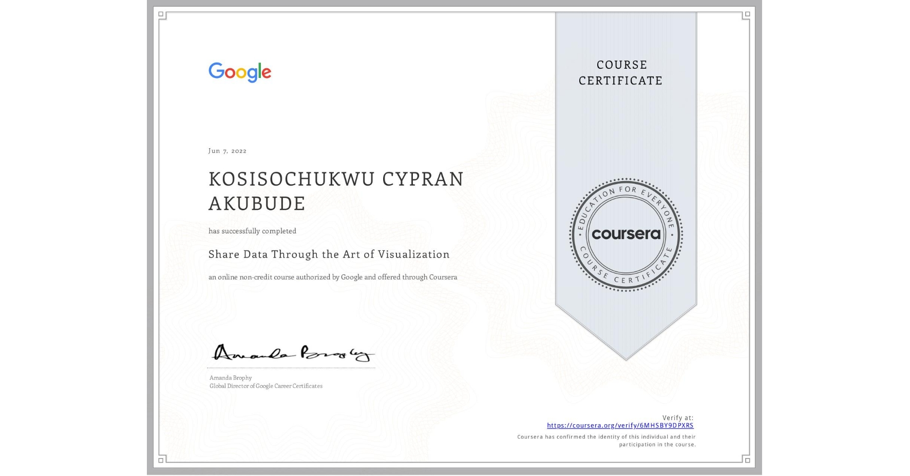
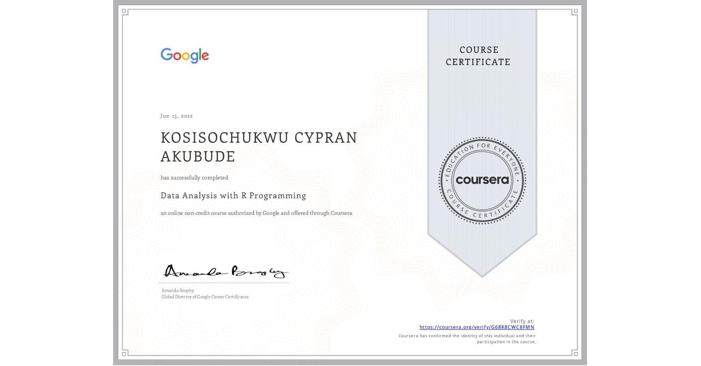

# Google Data Analytics Professional Certificate                                     

## 📍 About this Professional Certificate
Prepare for a new career in the high-growth field of data analytics, no experience or degree required. Get professional training designed by Google and have the opportunity to connect with top employers. There are 380,000 U.S. job openings in data analytics with a $74,000 median entry-level salary (US Burning Glass Labor Insight Report).

Boost your data analyst career by studying the fundamentals of data analysis and receiving hands-on experience. You will obtain practical expertise with data manipulation and analytical approaches through working with a range of data sources, project scenarios, and data analysis tools such as Excel, SQL, R, Jupyter Notebooks, and Tableau.

## 🥇 Professional Certificate

## 📙 Course Structures
There are 8 Courses in this Professional Certificate Specialization are as follows:

### Foundations: Data, Data, Everywhere
This is the first course in the Google Data Analytics Certificate. These courses will equip you with the skills you need to apply to introductory-level data analyst jobs. Organizations of all kinds need data analysts to help them improve their processes, identify opportunities and trends, launch new products, and make thoughtful decisions. In this course, you’ll be introduced to the world of data analytics through hands-on curriculum developed by Google.

### Ask Questions to Make Data-Driven Decisions
This is the second course in the Google Data Analytics Certificate. These courses will equip you with the skills needed to apply to introductory-level data analyst jobs. You’ll build on your understanding of the topics that were introduced in the first Google Data Analytics Certificate course. The material will help you learn how to ask effective questions to make data-driven decisions, while connecting with stakeholders’ needs. 

### Prepare Data for Exploration
This is the third course in the Google Data Analytics Certificate. These courses will equip you with the skills needed to apply to introductory-level data analyst jobs. As you continue to build on your understanding of the topics from the first two courses, you’ll also be introduced to new topics that will help you gain practical data analytics skills. You’ll learn how to use tools like spreadsheets and SQL to extract and make use of the right data for your objectives and how to organize and protect your data. 

### Process Data from Dirty to Clean
This is the fourth course in the Google Data Analytics Certificate. These courses will equip you with the skills needed to apply to introductory-level data analyst jobs. In this course, you’ll continue to build your understanding of data analytics and the concepts and tools that data analysts use in their work. You’ll learn how to check and clean your data using spreadsheets and SQL as well as how to verify and report your data cleaning results. 

### Analyze Data to Answer Questions
This is the fifth course in the Google Data Analytics Certificate. These courses will equip you with the skills needed to apply to introductory-level data analyst jobs. In this course, you’ll explore the “analyze” phase of the data analysis process. You’ll take what you’ve learned to this point and apply it to your analysis to make sense of the data you’ve collected. You’ll learn how to organize and format your data using spreadsheets and SQL to help you look at and think about your data in different ways. You’ll also find out how to perform complex calculations on your data to complete business objectives. You’ll learn how to use formulas, functions, and SQL queries as you conduct your analysis.

### Share Data Through the Art of Visualization
This is the sixth course in the Google Data Analytics Certificate. These courses will equip you with the skills needed to apply to introductory-level data analyst jobs. You’ll learn how to visualize and present your data findings as you complete the data analysis process. This course will show you how data visualizations, such as visual dashboards, can help bring your data to life. You’ll also explore Tableau, a data visualization platform that will help you create effective visualizations for your presentations.

### Data Analysis with R Programming
This course is the seventh course in the Google Data Analytics Certificate. These courses will equip you with the skills needed to apply to introductory-level data analyst jobs. In this course, you’ll learn about the programming language known as R. You’ll find out how to use RStudio, the environment that allows you to work with R. This course will also cover the software applications and tools that are unique to R, such as R packages. You’ll discover how R lets you clean, organize, analyze, visualize, and report data in new and more powerful ways. 

### Google Data Analytics Capstone: Complete a Case Study
This course is the eighth course in the Google Data Analytics Certificate. You’ll have the opportunity to complete an optional case study, which will help prepare you for the data analytics job hunt. Case studies are commonly used by employers to assess analytical skills. For your case study, you’ll choose an analytics-based scenario. You’ll then ask questions, prepare, process, analyze, visualize and act on the data from the scenario. You’ll also learn other useful job hunt skills through videos with common interview questions and responses, helpful materials to build a portfolio online, and more. 

## 
© 2022 Cypran Akubude
